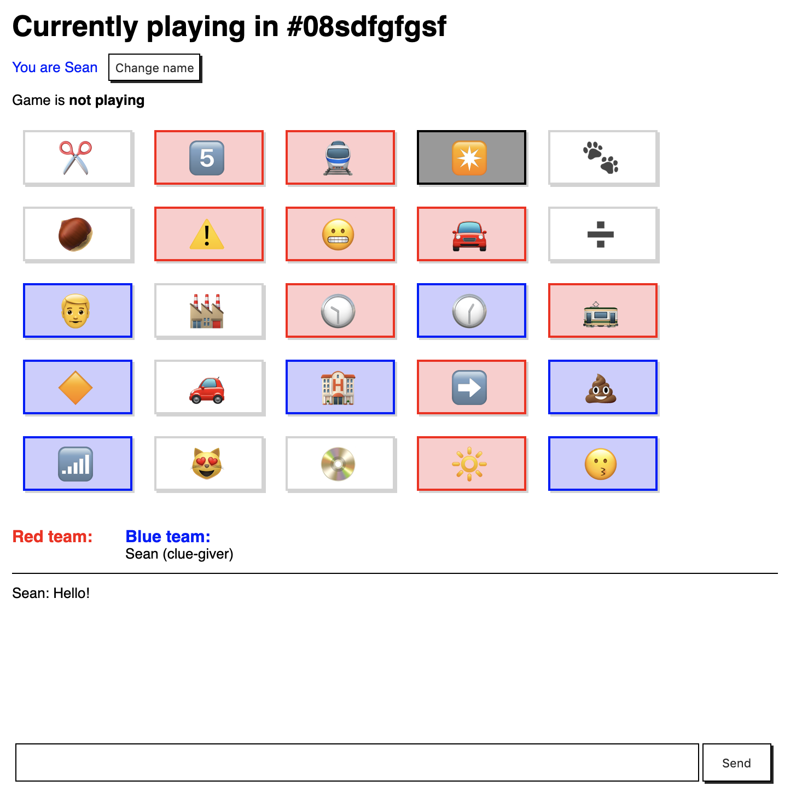

# Custom Codenames

Play Codenames online with custom tiles! Under development.

## Development

`yarn install`

Run `yarn start` to start the backend server.

To develop on the frontend client, run `yarn build --mode=development` to build the frontend bundle. Webpack will watch for changes but you will have to refresh.

Run `yarn lint` to autofix linting errors.

## Usage

https://custom-codenames.herokuapp.com/

